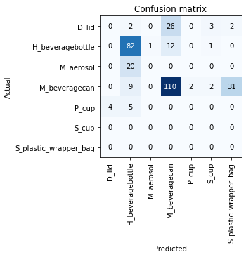

# WaterWaste Classifiers with Fastai

## Summary

Solution is based on a two stepp model system (but not yet an ensemble model system) that includes:
1. Detector model for detecting and cropping detection images - DNN1
2. Classifier model that is used classifying the individual detected and cropped images from DNN1
3. Post processing

### Base Classifier Model
Below is a list of models utilized during the WaterWaste Classifier experiements:
* [x] ResNet 50 - https://arxiv.org/abs/1512.03385
* [x] EfficentNet B0 & B3 - https://arxiv.org/abs/1905.11946
* [x] Densenet121 - https://arxiv.org/abs/1608.06993
* [ ] ResNeXt - https://arxiv.org/abs/1611.05431
* [ ] ensemble models

### Augmentaiton
* Random resize
* Random crop
* Random Rotation
* Random Flip
* Random shift of mean and standard deviation of object images
* Cutout - (e.g.., random boxes erased from image)

Below is an example batch plot of example augmentation applied on the training dataset:

## Training Summary

The goals we set out for training includes:
* during training Oversample via the sampler to weight more on positive targets 
* center crops that are sliced near center
* Epoch size = 0.15 * image size of train set

### Training Environment
Training experiments was performed on a Nvidia K80 GPU running on Azure VMs and Azure ML. Batch sized initialy started off between 8-16 and now varies between batch size 16/32/64 depending on the number of GPUs and model size. 

### Key Training Pipeline steps
* install fastai dependencies
* download and prepare training dataset and pretrain models (e.g., efficinet / Resnet)
* select appropriate augmentaitons for training set
* Run frozen training model 
* find favorable learning rate
* run unfrozen training
* review model evaluaiton metrics for tuning
* Run inference on unseen test images 
* Export saved model weights for model deployment and real world inferences

### Evaluation Metics
The primary evaluation metics utilized to score the classificaiton models is the `F1 score` which can represent the combined blanace of precision and recall scores into a single metric _(e.g., a low Percision score is a low F1 score.)_

| epoch | train_loss | valid_loss | accuracy | error_rate | f_beta   | precision | recall   | time  |
|-------|------------|------------|----------|------------|----------|-----------|----------|-------|
| 0     | 0.710801   | 0.462667   | 0.885124 | 0.114876   | 0.845550 | 0.885124  | 0.885124 | 01:39 |
| 1     | 0.452440   | 0.254465   | 0.926446 | 0.073554   | 0.891637 | 0.926446  | 0.926446 | 00:51 |
| 2     | 0.398415   | 0.225769   | 0.930579 | 0.069421   | 0.900176 | 0.930578  | 0.930578 | 00:51 |
| 3     | 0.251791   | 0.190383   | 0.942975 | 0.057025   | 0.908229 | 0.942975  | 0.942975 | 00:51 |
| 4     | 0.239432   | 0.178498   | 0.946281 | 0.053719   | 0.918014 | 0.946281  | 0.946281 | 00:54 |

below is the summary graph from the training depecting the CNN. 

