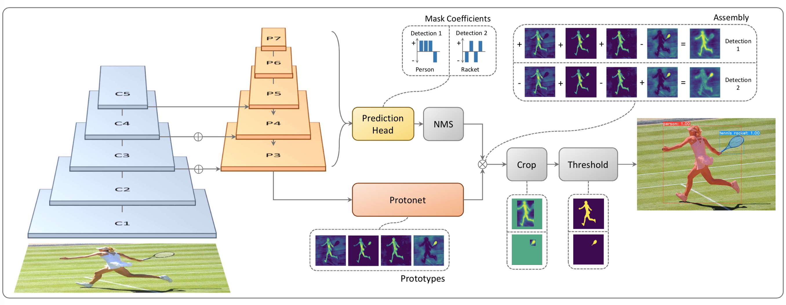

# Yolact, Yolact++ and Yolact-FCOS



## Training

```
python train_net.py --config-file configs/yolact_R50_x1
```

- `config-file` - argument referencing the configurations for the model to be trained
- `resume` - argument to flag the resume of training for a specified checkpoint number


## Model Evaluation (Validation)

After training the model, run the following commands on a selected model-`checkpoint`-.pth

```
python ./train_net.py --config-file configs/Yolact/yolacat_fcos_R50_zwds1_3c.yaml --eval-only MODEL.WEIGHTS output/fcos/yolacat_fcos_R50_zwds1_3c/model_0029999.pth
```

Running model model evaluation to test the current performance provides the following key parameters:
1. `config-file` - argument referencing the configurations for the model to be trained _(including model weights)_
2. `eval-only` - argument reference to a flag that we use to declace the current task is for training
3. `resume` - argument used to flag wither the current model eval task is to use a pre-trained model

Running this provides two outputs:


- `instances_predictions.pth` - are the predictions made by the model on the validation dataset
- `coco_instances_results.json` - are the saved results from the prediction
