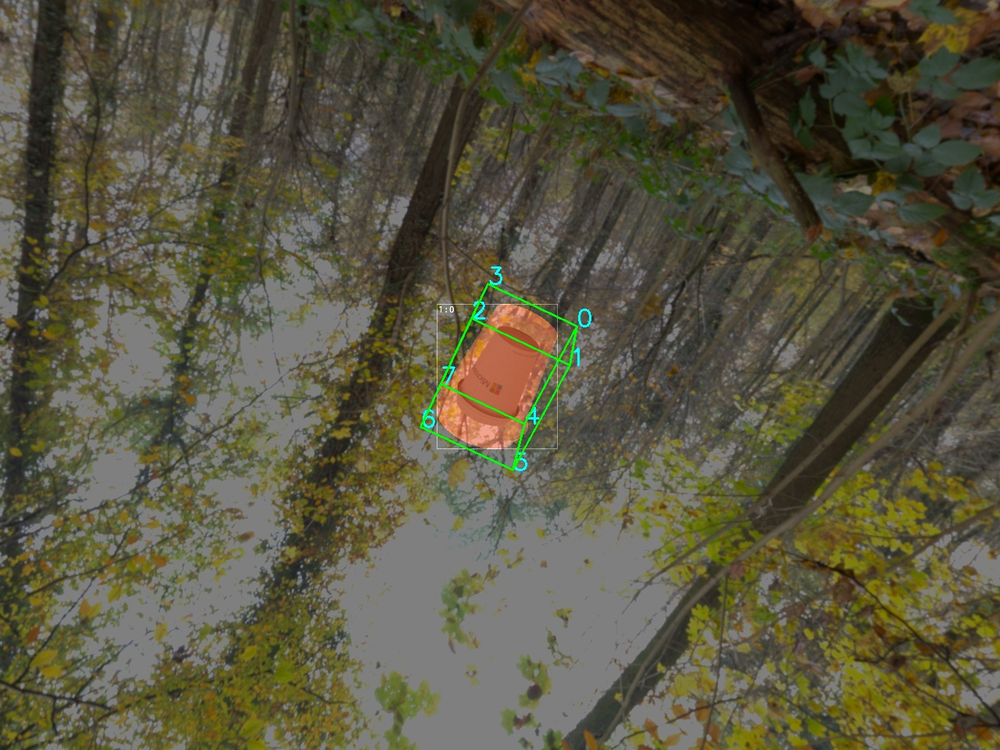

# 3D Object Detection with 6D Pose Estimation

>TODO: Insert 3D object detection screenshot from latest Z3D Pose Experiments 




----


## Overview 
__(still in research -  Summer 2020)__

This section of the Z3D repo introduces methods utilizing 3D key points generation using 6D achors to estipate objectes pose in an unsupervised learning approach without manually annotating keypoints. The overall goal is to established a set of models that consumes RGB-D images and predicts cooresponding 6D pose for each individual object in the image, in real-time. 

1. Object Detection - utilizing `Mask-RCNN` ??`mesh-rcnn`?? to detect object bounding box 
2. Depth estimation - utilzing pretrained depth estimation (monocular) along with the `Mask-RCNN` provided bounding boxes to find the 3D locaiton of the object.


__note__ as the Z3D 6D Pose project builds out, we will be leveraging the [AzureKinect](https://azure.microsoft.com/en-us/services/kinect-dk/) in subsequent dataset generation, inference and testing applications. 

### 6D Object Pose Estimation 

The task at hand is to estimate the 6D object pose of rigid objects. The 6D object pose is constructed of a 3x3 rotational matrix (`R`) and a 3x1 translation vector (`t`). `[R,t]` is the representiaton of the 6D transformation otherwise referred to as the transformation of the object coordiante to camera coordinate. 

Research topics for 6D object pose estimation
* instance level - e.g., template based matching with known 3D object model
* category level - e.g., exact 3D object unknown but identifed object geometric properties are related/similar to related 3D object model

## Getting Started

### Dataset setup


Mount storage file share of the Z3D dataset. 

> TODO provide instructions on mounting container

First you will need to download the weights DNN utilized for training: `sh scripts/download_depth_weights.sh`


### Setting up environment

#### Building the Container

login to container registry and build the docker file

```  
docker build . -f 6d.Dockerfile -t computervisi6b3936b2.azurecr.io/6d:1

docker run --gpus=all --shm-size 8G -p 8888:8888 -v /mnt/zerowastepublic/:/zerowastepublic -v /home/redne/ZeroWaste3D/research/6D_Pose/:/6D_Pose/ -it computervisi6b3936b2.azurecr.io/nocs:1 bash
```

----
### References

* https://github.com/j96w/6-PACK
* https://github.com/hughw19/NOCS_CVPR2019


```BibTeX
 @InProceedings{Wang_2019_CVPR,
               author = {Wang, He and Sridhar, Srinath and Huang, Jingwei and Valentin, Julien and Song, Shuran and Guibas, Leonidas J.},
               title = {Normalized Object Coordinate Space for Category-Level 6D Object Pose and Size Estimation},
               booktitle = {The IEEE Conference on Computer Vision and Pattern Recognition (CVPR)},
               month = {June},
               year = {2019}

@article{wang20196-pack,
  title={6-PACK: Category-level 6D Pose Tracker with Anchor-Based Keypoints},
  author={Wang, Chen and Mart{\'\i}n-Mart{\'\i}n, Roberto and Xu, Danfei and Lv, Jun and Lu, Cewu and Fei-Fei, Li and Savarese, Silvio and Zhu, Yuke},
  booktitle={International Conference on Robotics and Automation (ICRA)},
  year={2020}
}


```