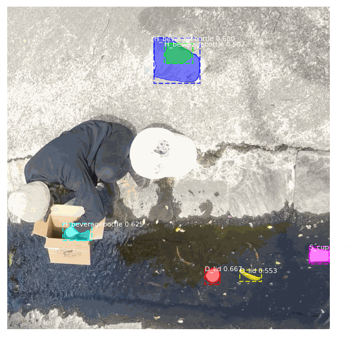
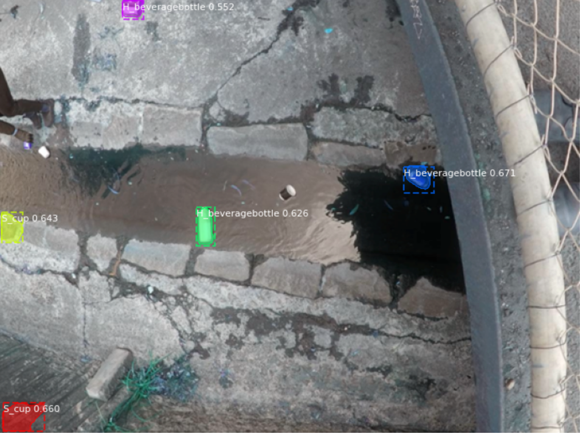

# ZeroWaste3D on Clean Ocean

__Objective: Train accurate detector for detecting waste in ocean/waterways to aid in the identification and reduction of polution and waste contaimination.__

__Problem Statement:__ `CSIRO (Commonwealth Scientific and Industrial Research Organization)`, Australia's national science agency, has provided the first ever global estimate for microplastics on the seafloor, with results suggesting there are 14 million tonnes in the deep ocean. Refer here for the recent (Oct 2020) published study on the amount of plastic pollution in our ocean and the corresponding impact: _[Microplastic Pollution in Deep-Sea Sediments From the Great Australian Bight](https://www.frontiersin.org/articles/10.3389/fmars.2020.576170/full)_

To be apart of the solution, we seek to assist the reduction of plastic ending up in the oceans by creating a synthetic dataset that is reasonably generalizable in the real world environment to detect plastic and other objects to support and inform recycling and waste industries to remove floating rubbish for removal and behavior change. 

>Solutions are needed now:
>- The World Economic Forum estimates one garbage truck of plastic alone is dumped into the ocean every minute of every day.
>- It estimates there could be more plastic in the ocean than fish by 2050.

### Summary

1. Generate synthetic dataset of important objects using Maya
2. Train detector using Faster RCNN networks on generated synthetics dataset
3. Fine tune detector with real world data

The use of generating syntehtics data enables an agile and iterative approach to rapidly improve the training dataset and model performance by automating the manual and time-consuming data collection and annotation activities. After reviewing the performance of the detector after each training iteration, we are able to rapidly generate additional datasets, 'waste' objects and add additional environmental parameters (e.g., reflections, debris, object occlusion) in minutes with a new large dataset.

### Results 

Performance of the training results is compared using the Mean Average Percisions scores. 

__WORK IN PROGRESS - Oct 2020__

| Train Dataset Images + Class info  | mAP  | mAPrecision IoU=0.5 | mARecall 100 |
|------------------------------------|------|---------------------|--------------|
| DS.0 Synthetics Only (#30K) - (3 class) | 0.39 | 0.47                | 0.XX         |
| DS.X Synthetics (#XXK) - (#classes) | 0.XX | 0.XX                | 0.XX         |
| DS.X Synthetics (#XXK) + Real (XX)  | 0.XX | 0.XX                | 0.XX         |
| DS.X Real Images Only (#XXX)        | 0.XX | 0.XX                | 0.XX         |

### Dataset Geneartion

Syntheitics objects were generated by rendering the 3D models with varations in object positioning (e.g., object angles) and lighting conditions. 

* XX 3D models used in syntheitcs images generation pipline
* XXK images were synthetically generated

3.20 Taking into account relevant international standards, establish a nationally consistent framework to enable ships to discharge clean segregated recyclable materials at Australian ports to divert this waste from landfill

The synthetics rendering pipeline can produce almost a limitless amount of labeled data that can be simulated in the targeted environment in minutes. For the detector to be most effective in the real world simulations of a variety of lighting, debris and environmental factors such as flowing water is generated to build a robust synthetics-to-real training dataset. Below are a sample of backgrounds used to subsequently render random objects to establish the training dataset for the detector. 

We utilize 3D models of objects (seen below on the left) to generate the sythetics images with a varing degree of object position, textures among the background discussed previously. On the right is the result of the generated dataset which provides us the the annotated localized coordinates and mask to begin training the model. 

<table>
  <tr>
    <td> Sample of CAD models used for training   </td>
    <td> Render Synthetics on backplat with masks </td>
  </tr>
  <tr>
    <td></td>
    <td></td>
  </tr>
</table> 

### Training Experiments

Dataset 0 training only utilized sythnetics dataset and only a selected number of categories to establish an initialbaseline. 

* 80/20 train/test split

>TODO: detail training experiment

-----

## National Waste Policy Action Plan - 2019 

_source: [National Waste Policy Action Plan by AU Gov](https://www.environment.gov.au/protection/waste-resource-recovery/publications/national-waste-policy-action-plan)_

|     Action                                                                                                                                                                                                                          |     Lead                                                 |     Partners                                                                                |     By      |
|-------------------------------------------------------------------------------------------------------------------------------------------------------------------------------------------------------------------------------------|----------------------------------------------------------|---------------------------------------------------------------------------------------------|-------------|
| 3.20 Taking into account relevant international standards,  establish a nationally consistent framework to enable ships to discharge  clean segregated recyclable materials at Australian ports to divert  this waste from landfill |     Australian   Government                              |     State   and territory governments Business sector                                       |     2022    |
| 3.21 Deliver industry-led target of 70%  of Australia’s plastic packaging being recycled or composted                                                                                                                               |     Australian Packaging Covenant Organisation           |     Business sector     All governments                                                     |     2025    |
| 5.1 Coordinate community campaigns to reduce and clean up waste on our coastlines and in our rivers,  through the Environment Restoration Fund                                                                                      |     Australian Government                                |     Conservation   Volunteers Australia,  Clean Up   Australia, Keep Australia Beautiful    |     2020    |
| 5.2 Implement the Pacific Ocean Litter Project,  to reduce plastics and other waste in oceans                                                                                                                                       |     Australian Government                                |     NGOs                                                                                    |     2020    |
| 5.3 Implement measures to reduce shipsourced waste in accordance with the International Maritime Organisation’s Action Plan to address marine  plastic litter from ships                                                            |     Australian Government                                |     All   governments Business sector                                                       |     2023    |
| 5.4 Identify problematic and unnecessary single-use plastic packaging  to provide an evidence base for industry to take coordinated action                                                                                          |     Australian   Packaging Covenant Organisation         |     All   governments                                                                       |     2019    |

