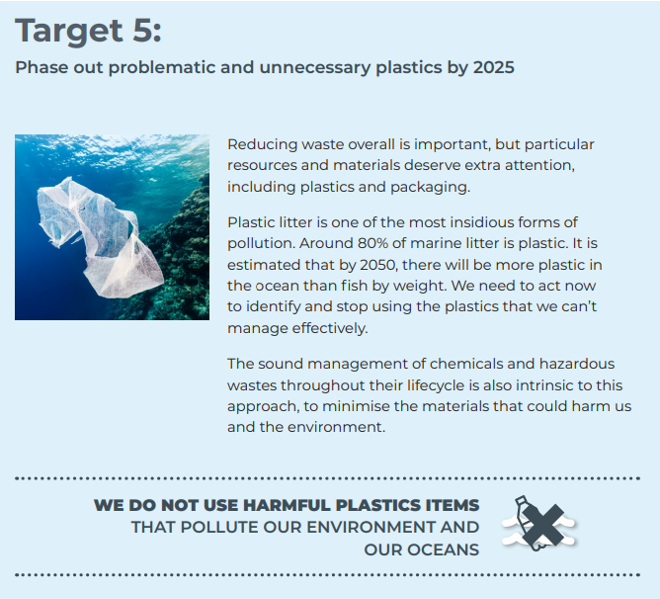

# ZeroWaste3D on Clean Ocean

Objective: Train accurate detector for detecting waste in ocean/waterways to aid in reduction of polution and waste contaimination. 

### Summary

1. Generate synthetic dataset of important objects using Maya
2. Train detector using Faster RCNN networks on generated synthetics dataset
3. Fine tune detector with real world data

### Results 

Performance of the training results is compared using the Mean Average Percisions scores. 

__WORK IN PROGRESS - Oct 2020__

| Train Dataset Images + Class info  | mAP  | mAPrecision IoU=0.5 | mARecall 100 |
|------------------------------------|------|---------------------|--------------|
| DS.0 Synthetics Only (#30K) - (3 class) | 0.39 | 0.47                | 0.XX         |
| DS.X Synthetics (#XXK) - (#classes) | 0.XX | 0.XX                | 0.XX         |
| DS.X Synthetics (#XXK) + Real (XX)  | 0.XX | 0.XX                | 0.XX         |
| DS.X Real Images Only (#XXX)        | 0.XX | 0.XX                | 0.XX         |

### Dataset Geneartion

Syntheitics objects were generated by rendering the 3D models with varations in object positioning (e.g., object angles) and lighting conditions. 

* XX 3D models used in syntheitcs images generation pipline
* XXK images were synthetically generated

3.20 Taking into account relevant international standards, establish a nationally consistent framework to enable ships to discharge clean segregated recyclable materials at Australian ports to divert this waste from landfill

### Training Experiments

Dataset 0 training only utilized sythnetics dataset and only a selected number of categories to establish an initialbaseline. 

* 80/20 train/test split

-----

## National Waste Policy Action Plan - 2019 

[National Waste Policy Action Plan by AU Gov](https://www.environment.gov.au/protection/waste-resource-recovery/publications/national-waste-policy-action-plan)

|     Action                                                                                                                                                                                                                          |     Lead                                                 |     Partners                                                                                |     By      |
|-------------------------------------------------------------------------------------------------------------------------------------------------------------------------------------------------------------------------------------|----------------------------------------------------------|---------------------------------------------------------------------------------------------|-------------|
| 3.20 Taking into account relevant international standards,  establish a nationally consistent framework to enable ships to discharge  clean segregated recyclable materials at Australian ports to divert  this waste from landfill |     Australian   Government                              |     State   and territory governments Business sector                                       |     2022    |
| 3.21 Deliver industry-led target of 70%  of Australia’s plastic packaging being recycled or composted                                                                                                                               |     Australian Packaging Covenant Organisation           |     Business sector     All governments                                                     |     2025    |
| 5.1 Coordinate community campaigns to reduce and clean up waste on our coastlines and in our rivers,  through the Environment Restoration Fund                                                                                      |     Australian Government                                |     Conservation   Volunteers Australia,  Clean Up   Australia, Keep Australia Beautiful    |     2020    |
| 5.2 Implement the Pacific Ocean Litter Project,  to reduce plastics and other waste in oceans                                                                                                                                       |     Australian Government                                |     NGOs                                                                                    |     2020    |
| 5.3 Implement measures to reduce shipsourced waste in accordance with the International Maritime Organisation’s Action Plan to address marine  plastic litter from ships                                                            |     Australian Government                                |     All   governments Business sector                                                       |     2023    |
| 5.4 Identify problematic and unnecessary single-use plastic packaging  to provide an evidence base for industry to take coordinated action                                                                                          |     Australian   Packaging Covenant Organisation         |     All   governments                                                                       |     2019    |